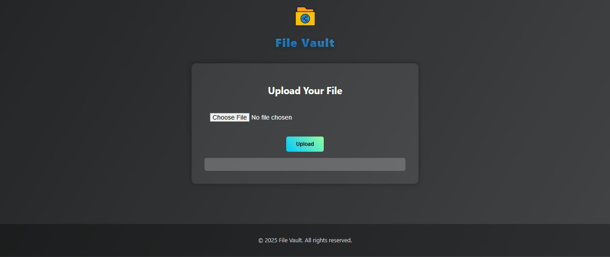

# 🔐 Secure File Sharing Web Application

A full-stack web application that enables users to **securely upload, store, and access files** with authentication and controlled access.

---

## 🚀 Key Features

* 🔐 User authentication (Login & Signup system)
* 📂 Secure file upload and storage
* 🛡️ Controlled file access for users
* 🔄 Backend API integration for file handling
* 🌐 Clean and responsive frontend interface

---

## 🛠️ Tech Stack

### Frontend

* HTML5
* CSS3
* JavaScript

### Backend

* Node.js
* Express.js

### Database

* MongoDB

---

## 📂 Project Structure

```
FILE_SHARING_PRO/
 ├── backend/
 │   ├── models/
 │   ├── server.js
 │   ├── package.json
 │
 ├── frontend/
 │   ├── index.html
 │   ├── login_signup.html
 │   ├── script.js
 │   ├── styles.css
```

---

## 🎯 Project Objective

To build a secure system that:

* Ensures safe file storage and access
* Demonstrates authentication and backend integration
* Simulates a real-world file sharing platform

---

## 📸 Preview



---

## 🔮 Future Enhancements

* Role-based access control
* File sharing via links
* Cloud storage integration
* File encryption

---

## 👨‍💻 Author

Gourav Singh
